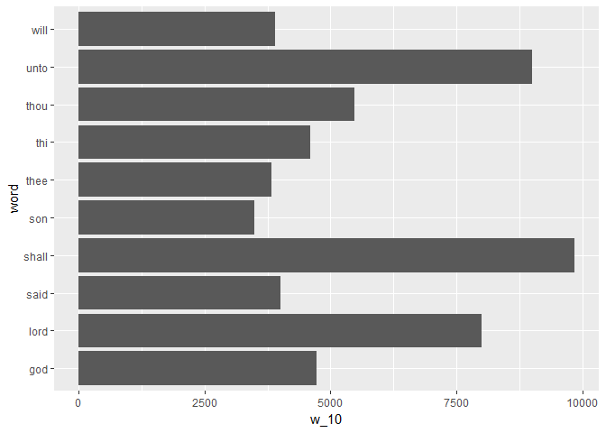
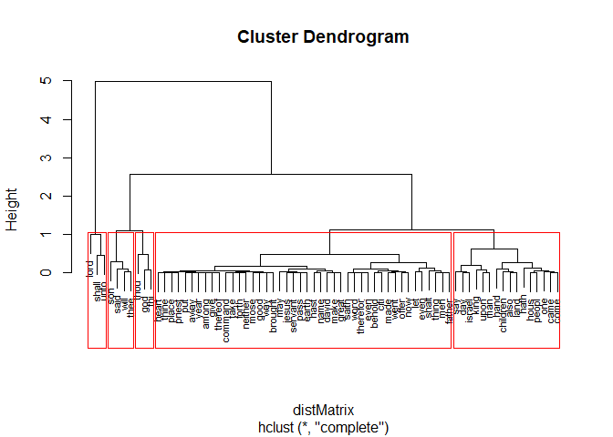
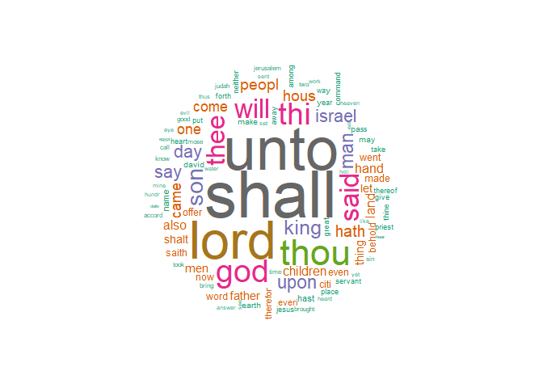

Sentiment Analysis and topic modelling for Bible. 

Libraries used 

```r
library(tm)
```

```
## Loading required package: NLP
```

```
## Warning: package 'NLP' was built under R version 3.4.1
```

```r
library(plyr)
library(httr)
```

```
## Warning: package 'httr' was built under R version 3.4.2
```

```
## 
## Attaching package: 'httr'
```

```
## The following object is masked from 'package:NLP':
## 
##     content
```

```r
library(stringr)
library(tm)
library(tibble)
```

```
## Warning: package 'tibble' was built under R version 3.4.2
```

```r
#The rest of these libraries are used for visualization
library(ggplot2)
```

```
## Warning: package 'ggplot2' was built under R version 3.4.2
```

```
## 
## Attaching package: 'ggplot2'
```

```
## The following object is masked from 'package:NLP':
## 
##     annotate
```

```r
library(wordcloud)
```

```
## Loading required package: RColorBrewer
```

```
## Warning: package 'RColorBrewer' was built under R version 3.4.1
```

```r
library(cluster)
```

```
## Warning: package 'cluster' was built under R version 3.4.2
```

```r
library(topicmodels)
```

```
## Warning: package 'topicmodels' was built under R version 3.4.2
```

```r
library(SnowballC)
```

Reading the Bible data

```r
bible_full = readLines("C:\\Users\\Sayari Ghosh\\Desktop\\santa clara university\\2016\\Spring2017\\R\\ProgramCode\\data_files\\ascii_bible.txt")
```

Data Cleaning

```r
#remove leading whitespaces
bible_text = str_replace(bible_full,"^\\s+","")  
res = grep("[0-9][0-9][0-9]:[0-9][0-9][0-9]",bible_text)
temp = NULL
for (i in seq(1:(length(res)-1))){
  x = paste(bible_text[res[i]:(res[i+1]-1)],collapse = " ")
  temp = c(temp,x)
}
verses = c(temp,paste(bible_text[res[length(res)]:length(bible_text)],collapse = " "))
verses[1:5]
```

```
## [1] "001:001 In the beginning God created the heaven and the earth. "                                                                                        
## [2] "001:002 And the earth was without form, and void; and darkness was upon the face of the deep. And the Spirit of God moved upon the face of the waters. "
## [3] "001:003 And God said, Let there be light: and there was light. "                                                                                        
## [4] "001:004 And God saw the light, that it was good: and God divided the light from the darkness. "                                                         
## [5] "001:005 And God called the light Day, and the darkness he called Night. And the evening and the morning were the first day. "
```

Chapters length 

```r
chap = grep("[0-9][0-9][0-9]:001",verses)
length(chap)
```

```
## [1] 1189
```

Taking only the string part and removing the chapter and verse numbers from the 
Bible text. 


```r
ver_txt =  str_split_fixed(verses, "[0-9][0-9][0-9]:[0-9][0-9][0-9] ",2)
ver_txt = ver_txt[,2]
```

Using the TM package in R to cleaning and process the data. This includes 
converting to lower case, remove numbers, remove punctation, remove common 
stopwords, strip whitespace, and get rid of special characters. I also utilized 
stemming, which should cut words to their base. 

Converting the text to lower case.

```r
ver_txt = str_to_lower(ver_txt)
ver_txt[1:5]
```

```
## [1] "in the beginning god created the heaven and the earth. "                                                                                        
## [2] "and the earth was without form, and void; and darkness was upon the face of the deep. and the spirit of god moved upon the face of the waters. "
## [3] "and god said, let there be light: and there was light. "                                                                                        
## [4] "and god saw the light, that it was good: and god divided the light from the darkness. "                                                         
## [5] "and god called the light day, and the darkness he called night. and the evening and the morning were the first day. "
```

Convert the text of all verses into a Corpus.


```r
ver_txt = Corpus(VectorSource(ver_txt))
ver_txt
```

```
## <<SimpleCorpus>>
## Metadata:  corpus specific: 1, document level (indexed): 0
## Content:  documents: 31102
```

Remove all punctuation  

```r
ver_txt = tm_map(ver_txt,removePunctuation)
```

Remove all stopwords.  

```r
ver_stp = ver_txt
ver_stp = tm_map(ver_stp,removeWords,stopwords("english"))
```

Now stem the text, to remove multiplicity of similar words of the same root. 

```r
ver_stem = tm_map(ver_stp,stemDocument)
ver_uniq = DocumentTermMatrix(ver_stem)
ver_uniq
```

```
## <<DocumentTermMatrix (documents: 31102, terms: 9125)>>
## Non-/sparse entries: 332862/283472888
## Sparsity           : 100%
## Maximal term length: 18
## Weighting          : term frequency (tf)
```

How many distinct words are there in the bible, after stemming?

```r
ver_tdm = DocumentTermMatrix(ver_stem)
ver_tdm
```

```
## <<DocumentTermMatrix (documents: 31102, terms: 9125)>>
## Non-/sparse entries: 332862/283472888
## Sparsity           : 100%
## Maximal term length: 18
## Weighting          : term frequency (tf)
```

The 5 most common words in the bible. 

```r
ver_mat = as.matrix(ver_tdm)
cm_words = sort(colSums(ver_mat), decreasing = TRUE) #frequency for each term
w_5 = head(cm_words,5)
w_5 #5 most common words
```

```
## shall  unto  lord  thou   god 
##  9838  8997  8007  5474  4727
```

Top 10 frequent word in Bible

```r
w_10 = head(cm_words,10)
w_10 = rownames_to_column(data.frame(w_10), var="word")  
ggplot(w_10, aes(x=word,y=w_10)) + geom_bar(stat="identity") + coord_flip()
```

<!-- -->

5 least common words

```r
cm_words1 = sort(colSums(ver_mat), decreasing = FALSE) #frequency for each term
u_5 = head(cm_words1,5)
u_5 
```

```
##   pison  tiller tillest     nod   jabal 
##       1       1       1       1       1
```

This is the result of clustering of the text in Bible. I have taken top 70 words and created 5 cluster from it using hierarchical clustering method. 

```r
h_70 = head(cm_words,70)
h_70 = as.matrix(h_70)
#Creates the distance matrix
distMatrix = dist(scale(h_70))
fit = hclust(distMatrix)
plot(fit, cex=0.67)
rect.hclust(fit, k=5) #5 clusters
```

<!-- -->

wordcloud of the top 100 words in the bible. 

```r
pal2 <- brewer.pal(8,"Dark2")
w_100 = head(cm_words,100) 
w_100_nms = names(w_100) #names of top 100 words
wordcloud(w_100_nms,w_100,scale=c(5, .1),min.freq=2,
max.words=Inf, random.order=FALSE, rot.per=.15, colors=pal2) #creating word cloud
```

<!-- -->

Mood score the original text of the bible (before stemming)

```r
#creating positive and negitive words
HIDict = readLines("C:\\Users\\Sayari Ghosh\\Desktop\\santa clara university\\2016\\Spring2017\\R\\ProgramCode\\data_files\\inqdict.txt")
dict_pos = HIDict[grep("Pos",HIDict)]
poswords = NULL
for (s in dict_pos) {
    s = strsplit(s,"#")[[1]][1]
    poswords = c(poswords,strsplit(s," ")[[1]][1])
}
dict_neg = HIDict[grep("Neg",HIDict)]
negwords = NULL
for (s in dict_neg) {
    s = strsplit(s,"#")[[1]][1]
    negwords = c(negwords,strsplit(s," ")[[1]][1])
}
poswords = tolower(poswords)
negwords = tolower(negwords)
poswords = unique(poswords)
negwords = unique(negwords)

#Mood Scoring the bible text
ver_txt =  str_split_fixed(verses, "[0-9][0-9][0-9]:[0-9][0-9][0-9] ",2)
ver_txt = ver_txt[,2] #bible text
ver_txt = Corpus(VectorSource(ver_txt))
ver_txt = tm_map(ver_txt,removePunctuation)
v1 = data.frame(text = sapply(ver_txt, as.character), stringsAsFactors = FALSE) #corpus to dataframe
v1 = str_replace(v1$text,"^\\s+","")  #remove leading whitespaces
v1 = trimws(v1,which = "right") # triming trailing whitespaces
v1 = str_to_lower(v1) 
ver_txt1 = unlist(strsplit(v1," ")) #spliting by space to get words
posmatch = match(ver_txt1,poswords)
numposmatch = length(posmatch[which(posmatch>0)])
negmatch = match(ver_txt1,negwords)
numnegmatch = length(negmatch[which(negmatch>0)])
print(c(numposmatch,numnegmatch))
```

```
## [1] 56827 38769
```
The Bible is more positive words than negative words so it can be concluded that 
the overall sentiment is positive. 


Topic Modelling
The main 3 topics in the bible, and the top 25 words in each topic. 

```r
burnin = 4000
iter = 2000
thin = 500
seed = list(2003,5,63,100001,765)
nstart = 5
best = TRUE

#Number of topics
k = 3

res <-LDA(ver_tdm, k, method="Gibbs", control = list(nstart = nstart, seed = seed, best = best, burnin = burnin, iter = iter, thin = thin))

#Show topics
res.topics = as.matrix(topics(res))
#print(res.topics)
res.terms = as.matrix(terms(res,25))
print(res.terms)
```

```
##       Topic 1    Topic 2   Topic 3   
##  [1,] "lord"     "shall"   "unto"    
##  [2,] "thou"     "upon"    "said"    
##  [3,] "god"      "day"     "son"     
##  [4,] "thi"      "one"     "king"    
##  [5,] "will"     "even"    "israel"  
##  [6,] "thee"     "made"    "say"     
##  [7,] "hath"     "offer"   "hous"    
##  [8,] "hand"     "everi"   "peopl"   
##  [9,] "thing"    "man"     "came"    
## [10,] "shalt"    "also"    "children"
## [11,] "man"      "make"    "land"    
## [12,] "let"      "great"   "father"  
## [13,] "saith"    "earth"   "men"     
## [14,] "therefor" "place"   "come"    
## [15,] "hast"     "priest"  "went"    
## [16,] "may"      "put"     "now"     
## [17,] "heart"    "away"    "citi"    
## [18,] "thine"    "thereof" "name"    
## [19,] "give"     "take"    "david"   
## [20,] "command"  "forth"   "pass"    
## [21,] "neither"  "two"     "jesus"   
## [22,] "way"      "bring"   "servant" 
## [23,] "good"     "heaven"  "behold"  
## [24,] "know"     "set"     "year"    
## [25,] "thus"     "like"    "among"
```

